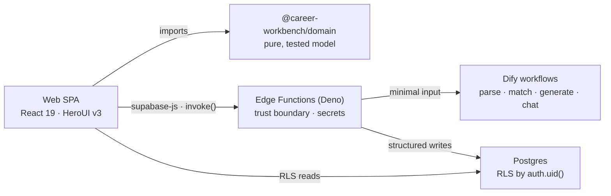

<div align="center">

# Career Workbench

**An AI workbench that turns your fact library + a target job description into a
tailored résumé — one that's traceable, not hallucinated.**

[](./apps/web/tsconfig.json)
[](https://react.dev)
[](https://supabase.com)
[](https://deno.com)
[](./packages/domain)

English · [中文](./README.zh-CN.md)

### 🔗 [Live Demo](https://career-workbench.vercel.app) · [Architecture](./docs/architecture.md)


</div>

---

## What it is

Tailoring a résumé per role is tedious, and LLMs make it fast — but they also
invent experience you never had. Career Workbench is built around one constraint:
**keep AI useful without letting it lie.** Every generated word is anchored to a
personal _fact library_, and every match is explained with evidence, not just a
score.

The core loop: **upload résumé → fact library → browse jobs → AI match (evidence /
gaps / risks) → generate a tailored résumé → edit with AI patches you accept or
reject.**

## 🏗 Architecture at a glance



The browser never calls an AI provider directly. Everything secret-bearing or
cross-user goes through an Edge Function. **Full tour →
[docs/architecture.md](./docs/architecture.md).**

## 🧩 Tech stack

| Layer    | Choices                                                                                       |
| -------- | --------------------------------------------------------------------------------------------- |
| Frontend | React 19, TypeScript (strict), Vite, Tailwind CSS v4, HeroUI v3, Zustand, assistant-ui, Quill |
| Backend  | Supabase — Auth, Postgres + RLS, Edge Functions (Deno)                                        |
| AI       | Dify workflows/chatflow (parse · job-parse · match · generate · chat) behind Edge Functions   |
| Tooling  | pnpm workspace (monorepo), Vitest, Prettier, Deno toolchain                                   |

## 📸 Screenshots

| Onboarding                                                                            | Job match report                                                                      | Résumé editor                                                                          |
| ------------------------------------------------------------------------------------- | ------------------------------------------------------------------------------------- | -------------------------------------------------------------------------------------- |
|  |  |  |

## 🚀 Quickstart

```bash
pnpm install
pnpm dev          # web only, with local fixtures — no secrets needed
```

`/` is a public landing page. The app runs in fixture mode out of the box (mock AI +
local data), so you can explore the UI without any Supabase or Dify setup. To run
the full stack (Supabase + Edge Functions + AI), see
**[development.md](./development.md)**.

```bash
pnpm check && pnpm test && pnpm build   # verify
```

## 📂 Project structure

```
apps/web              React 19 SPA (TypeScript strict)
packages/domain       Pure domain model & logic — résumé · profile · JD · patch · match
packages/mock         MSW-based mock of the Supabase stack for keyless fixture-mode dev
packages/shared       Reserved seam for shared cross-package types & schema utils
supabase/functions    Deno Edge Functions — the only place secrets live
supabase/migrations   Postgres schema + RLS
dify/                 Versioned Dify workflow definitions
docs/                 Architecture, ADRs, product, project structure
development.md        Development, validation, deployment
feature-spec/         Per-feature specs and collaboration workflow
```

## 📚 Documentation

- [Architecture](./docs/architecture.md) — the 5-minute engineering tour
- [Data Model](./docs/architecture.md#data-model) · [Backend](./docs/architecture.md#backend)
- [Product Overview](./docs/product-overview.md) — what it does and what it deliberately doesn't
- [Development](./development.md) — run the full stack locally & deploy
- [Feature specs (中文)](./feature-spec) — deep per-feature design

---

<sub>Status: MVP. Core loop (upload → profile → job → match → generate → edit) is
wired end to end. AI run-trace and PDF export are in progress — see
[development.md](./development.md) for the live status.</sub>
