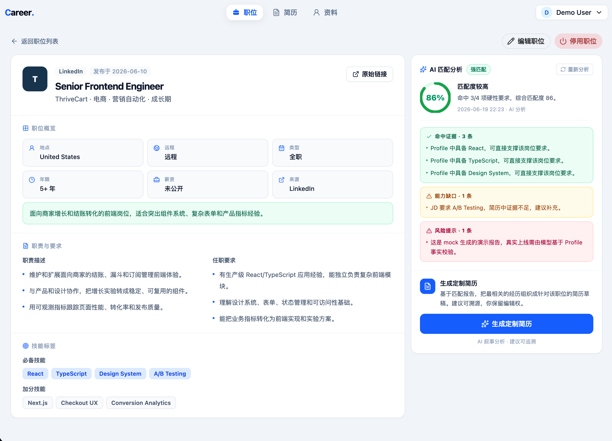
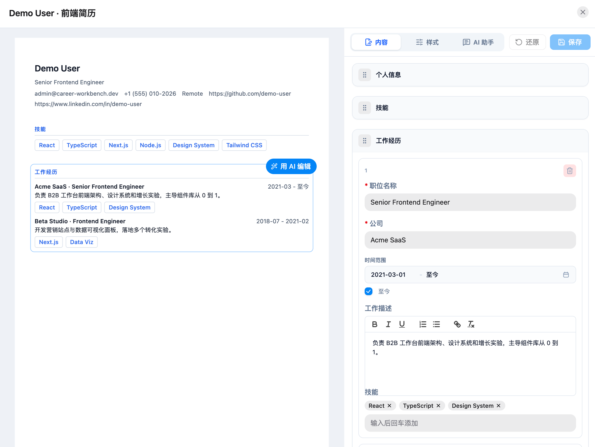
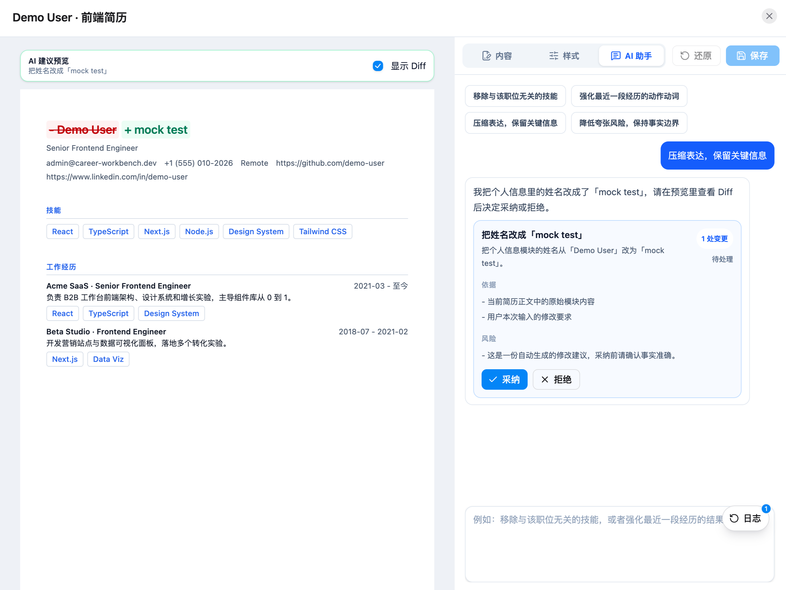
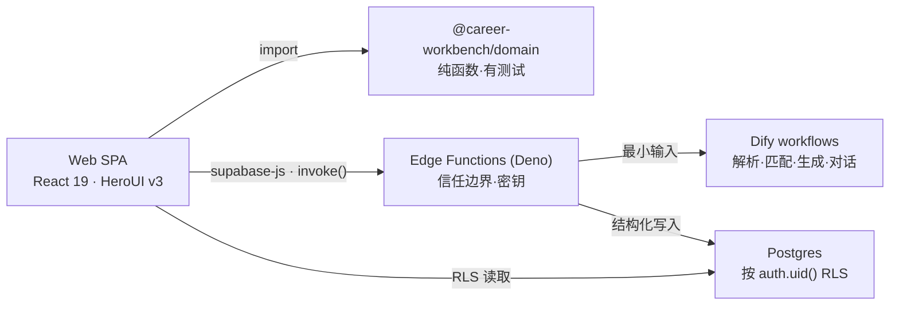

# Career Workbench

**面向开发者的 AI 简历工作台:用「个人事实库 + 目标 JD」生成一份可追溯、不胡编的定制简历。**

[English](./README.md) · 中文

### 🔗 [在线体验](https://career-workbench.vercel.app) · [架构文档](./docs/architecture.md)







---

## 这是什么

按岗位反复改简历很枯燥,LLM 让它变快——但也会编造你没有的经历。Career Workbench 围绕
一个核心约束设计:**让 AI 有用,但不让它说谎。** 每一句生成内容都锚定在个人「事实库」上,
每一次匹配都给出证据,而不只是一个分数。

核心闭环:**上传简历 → 事实库 → 浏览职位 → AI 匹配(证据 / 缺口 / 风险)→ 生成定制简历 →
在编辑器里采纳/拒绝 AI 修改建议。**

## 🏗 架构一图流



浏览器从不直接调用 AI 服务。所有涉密或跨用户的操作都走 Edge Function。
**完整讲解 → [docs/architecture.md](./docs/architecture.md)。**

## 🧩 技术栈

**前端**


**后端 / AI**


**工具链**


## 🚀 快速开始

```bash
pnpm install
pnpm dev          # 仅前端 + 本地 fixture,无需任何密钥
```

`/` 是公开落地页。开箱即用的 fixture 模式(mock AI + 本地数据)让你无需配置 Supabase/Dify
即可浏览 UI。要跑完整链路(Supabase + Edge Functions + AI),见
**[development.md](./development.md)**。

```bash
pnpm check && pnpm test && pnpm build   # 验证
```

## 📚 文档

- [架构总览](./docs/architecture.md) —— 5 分钟工程视角导览
- [数据模型](./docs/architecture.md#data-model) · [后端架构](./docs/architecture.md#backend)
- [产品概览](./docs/product-overview.md) —— 做什么、刻意不做什么
- [本地开发与部署](./development.md)
- [功能规格(中文)](./feature-spec) —— 各功能深度设计

---

状态:MVP。核心闭环(上传 → Profile → 职位 → 匹配 → 生成 → 编辑)已端到端打通; AI Run Trace 与 PDF 导出进行中。
