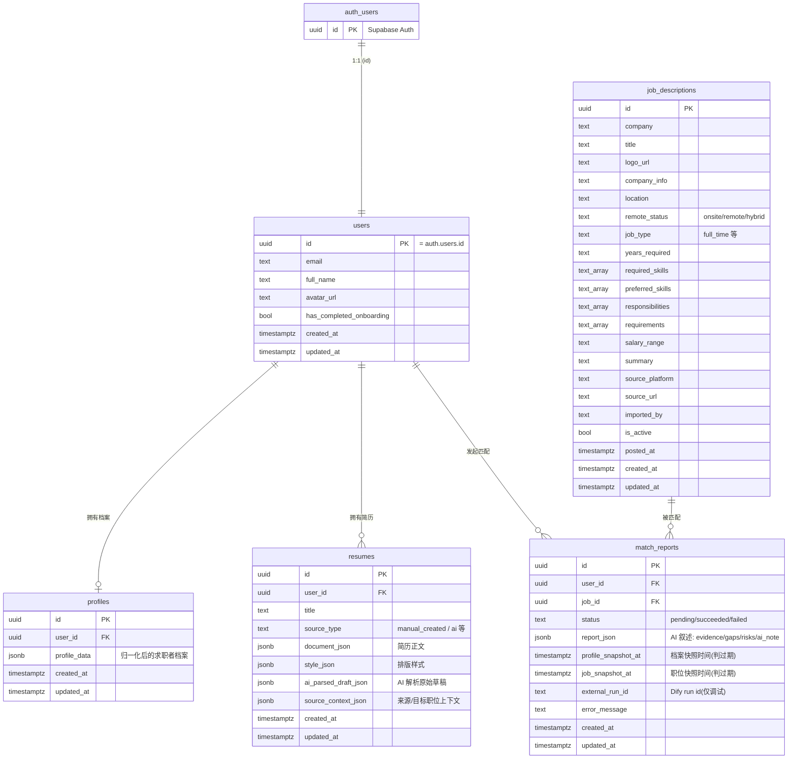
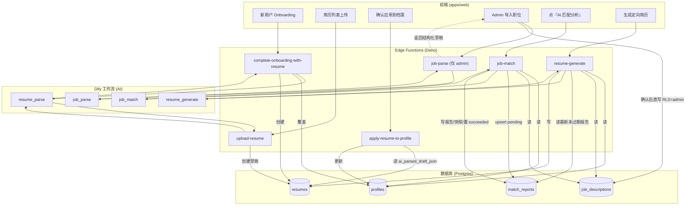

# 架构图（Mermaid）

> 用 Mermaid 描述项目的**数据逻辑**与**业务逻辑**。GitHub / VSCode（装 Mermaid 插件）/ 语雀等可直接渲染。
> 改逻辑时请顺手更新本文件，避免图过期。

---

## 一、数据逻辑：实体关系图（ER）

数据库表结构与外键关系。所有业务表都挂在 `users` 上（`users.id` 又外键到 Supabase 的 `auth.users`）。

**要点**

- `match_reports` 每 `(user_id, job_id)` 唯一一行，重新分析就 upsert 覆盖，不留历史。
- 匹配**分数**由规则计算、不入库；`report_json` 只存 AI 的叙述（evidence / gaps / risks / ai_note）。
- 两个 `*_snapshot_at` 记录分析时档案/职位的 `updated_at`，用来判断报告是否过期。

---

## 二、业务逻辑：核心流程图

用户动作 → Edge Function → Dify 工作流（AI）→ 落库。

**三条值得记住的设计**

1. **AI 成本只花一次**：`upload-resume` 解析后把原始结果存进 `resumes.ai_parsed_draft_json`；`apply-resume-to-profile` 用户确认时**不再调 AI**，直接读草稿归一化，确认动作可重复执行且结果一致。
2. **职位导入不落库在函数里**：`job-parse` 只解析返回草稿，真正保存由 admin 在前端确认后直写 `job_descriptions`（RLS 限 admin）。
3. **匹配是 on-demand 且幂等**：`job-match` 先写一行 `pending`，AI 成功后置 `succeeded` 并存双快照；`resume-generate` 会复用「最新未过期」的匹配报告。
