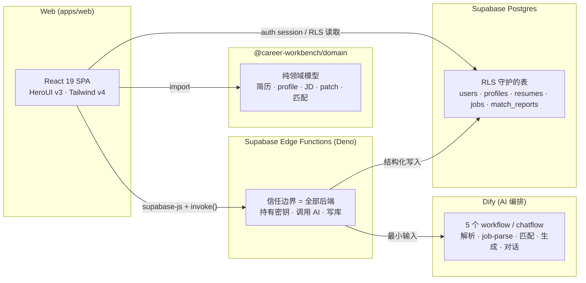
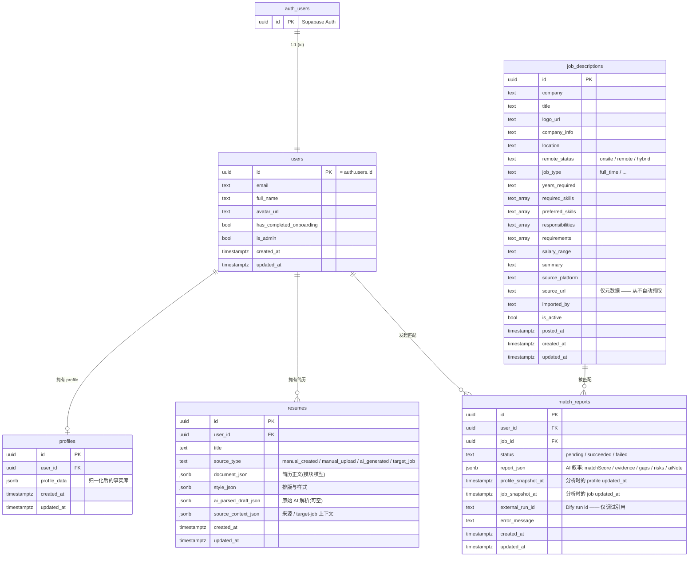
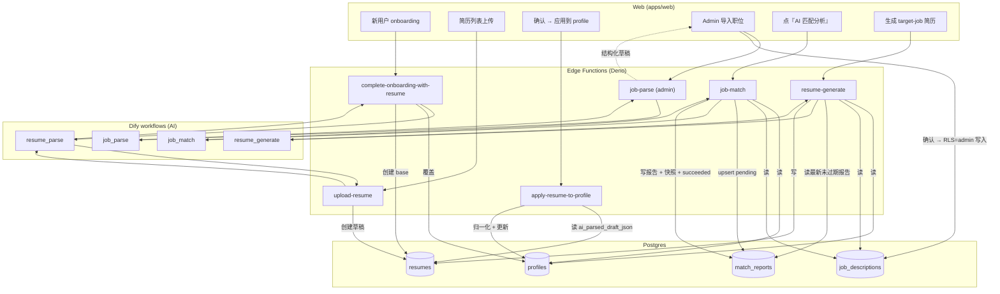

# 架构

**目录**

- [系统全景](#overview)
- [数据模型](#data-model)
- [后端(Edge Functions + Dify)](#backend)
- [工程规范](#conventions)

## 一段话讲清问题

求职者为不同岗位反复改同一份简历,LLM 让这件事变快——但也会编造你没有的经历。难点不在于
**生成**一份定制简历,而在于让生成的每一个字都**可追溯到候选人真实做过的事**,同时把 AI
花费控制在低位、并保证业务状态在重试下依然正确。整个项目就是围绕这个约束构建的。

<a id="overview"></a>

## 系统全景



浏览器从不直接和 Dify 或任何模型对话。任何需要密钥、高权限写入或事务性结果的操作,都走
Edge Function——它们就是这个项目的全部后端(没有独立 `apps/api`)。浏览器只能看到自己 RLS
作用域内的行,以及本项目自己的 Edge 端点。

承重的是 `packages/domain`:简历/profile/JD 类型、简历 patch 引擎、匹配报告过期规则、归一化
函数,全部以**纯函数 + 单元测试**的形式放在这里。Web 应用和 Edge Functions 都依赖它,所以
同一套规则在网络两侧一致生效。目录结构见 [project-structure.md](./project-structure.md)。

<a id="data-model"></a>

## 数据模型

schema 很小——五张表——且每张业务表都挂在 `users` 上,`users` 与 Supabase 的 `auth.users`
1:1。访问控制**不**在应用代码里实现;它落在基于 `auth.uid()` 的 Row-Level Security 策略中。
浏览器持有一个 Supabase session,只能读写属于自己的行。

> schema 事实源:[`supabase/migrations/`](../supabase/migrations)。本节与线上真实列结构保持同步。

### 实体关系



### 各表说明

**`profiles` —— 事实库。** `profile_data` 是一份归一化后的 JSONB 文档(个人信息、工作、项目、
教育、技能、求职偏好、自定义模块),是 AI 被允许取材的**唯一事实源**。生成与匹配读取它,但
无权编造里面没有的经历。归一化过程是
[`@career-workbench/domain`](../packages/domain/src/resume/normalize.ts) 中的纯函数,有测试。

**`resumes` —— 内容与样式分离。** `document_json`(简历说了什么)与 `style_json`(它长什么样)
分开存储,这样编辑器可在不动内容的前提下换模板,AI 也能在不动排版的前提下改写内容。
`ai_parsed_draft_json` 缓存上传时的原始 AI 解析,因此确认进 profile 时不需要第二次 AI 调用。`source_type` 区分来源:`manual_created` · `manual_upload`
· `ai_generated` · `target_job`。

**`match_reports` —— 每对一行,upsert。** 每 `(user_id, job_id)` **恰好一行**,重新分析就
upsert 覆盖、不留历史。匹配分数和叙事都存在 `report_json`(由 AI 产出);两个 `*_snapshot_at`
列记录分析时 profile 与 job 的 `updated_at`,任一输入自快照以来变化即视为过期——这就是全部的
缓存失效策略,纯规则
[`isMatchReportStale`](../packages/domain/src/job/match-report.ts))。

**`job_descriptions` —— admin 导入,从不爬取。** JD 是结构化的(技能/职责/要求都是数组),因此
匹配可逐字段推理。`source_url` 是人工填写的元数据——链接从不被跟踪或爬取(数据来源边界见
[product-overview](./product-overview.md))。

### 访问控制

每张业务表都启用 RLS。模式统一:仅当某行的 `user_id` 等于 `auth.uid()` 时该行才可见、可写。
`job_descriptions` 额外加一个 admin 例外——写入要求 `users.is_admin = true`——因为职位是共享、
由 admin 维护的内容,而非按用户隔离的数据。建表、RLS 与 Storage policy 都在
[`supabase/migrations/`](../supabase/migrations) 中维护。

<a id="backend"></a>

## 后端(Edge Functions + Dify)

这个项目**没有独立的 `apps/api`**——Supabase Edge Functions(Deno)就是全部后端。每一次后端
请求都走同一条路径:

```
用户动作  →  Edge Function (Deno)  →  Dify workflow  →  Postgres
```

浏览器从不直接调用 Dify 或模型。Edge Functions 是信任边界——持有 API key、执行高权限写入,并把
松散的 AI 输出翻译成结构化业务结果。注意并非所有函数都调 AI:`apply-resume-to-profile` 是纯
归一化、不碰 AI。

### 函数与 workflow

每个 Dify app 有**自己**的 API key,由恰好一个 Edge Function 读取。缺 key 会以 `config` 阶段
错误**失败关闭**,而不是悄悄降级。

| Edge Function                     | Dify workflow           | 做什么                                          |
| --------------------------------- | ----------------------- | ----------------------------------------------- |
| `upload-resume`                   | `resume_parse`          | 解析上传简历 → 把原始草稿缓存到简历行           |
| `complete-onboarding-with-resume` | `resume_parse`          | 解析 → 覆盖 profile + 创建 base 简历(首次)      |
| `apply-resume-to-profile`         | ——(无 AI)               | 重读缓存草稿 → 归一化 → 写 profile              |
| `job-parse`                       | `job_parse`             | 解析粘贴的 JD / 截图 → 结构化草稿(仅 admin)     |
| `job-match`                       | `job_match`             | 读 profile + JD → 匹配叙事 → 写 `match_reports` |
| `resume-generate`                 | `resume_generate`       | profile + JD + 最新匹配报告 → target-job 简历   |
| `resume-chat`                     | `resume_chat`(chatflow) | 对话式简历编辑 → 给出用户采纳/拒绝的 patch      |

workflow 定义版本化存放在 [`dify/`](../dify);key 命名见
[`supabase/.env.example`](../supabase/.env.example) 与 [`dify/README.md`](../dify/README.md)。

### 端到端流程



<a id="conventions"></a>

## 工程规范

- **类型:** Web 应用与各 package 全链路 TypeScript **strict**。
- **测试:** 领域逻辑是纯函数且有单元测试(Vitest)——简历 patch 的 apply/accept、样式模板、
  匹配报告过期判断。后续按风险补 AI adapter mock、JD parse 契约、表单/筛选交互测试。
- **UI 组件:** 基础组件直接从 `@heroui/react` 导入;**不**重新引入 Antd / Base UI / shadcn,
  **不**维护 `src/components/ui` primitive 目录。只服务工作台 shell 的共享样式 helper 放
  `src/components/workbench`。
- **抽组件:** 单文件超 ~250 行且含多区块、跨页面复用、或有独立状态/事件/视觉结构时才抽;
  **不**为"看起来架构好"抽空壳组件,**不**抽尚未稳定的跨页面抽象。
- **类型注释:** 领域类型文件顶部用简短注释说明职责边界;导出的 `type` 必须有类型级注释;
  字段注释只在易误用、有兼容历史或格式/业务约束时加,字段名自解释就不重复。
- **兼容代码:** 项目未上线,默认不为旧草稿/历史 mock 保留冗余兼容层;删字段/改结构时同步清理
  类型、默认值、归一化、UI 和文档;确需保留的兼容逻辑必须有明确退出条件。
- **Edge Functions:** 走 Deno 工具链(`pnpm functions:check` / `:lint` / `:fmt:check`),
  不要用 Prettier 处理 `supabase/functions`。
- **提交前:** `pnpm check && pnpm test && pnpm build`;另用
  `rg -n "antd|@base-ui/react|components/ui|shadcn|class-variance-authority" apps/web/src`
  反查是否偏离 HeroUI 体系。命令细节见 [development.md](../development.md)。
- **文档:** 被当作事实源,与 schema 和代码保持同步(每个主题只有一个家)。
