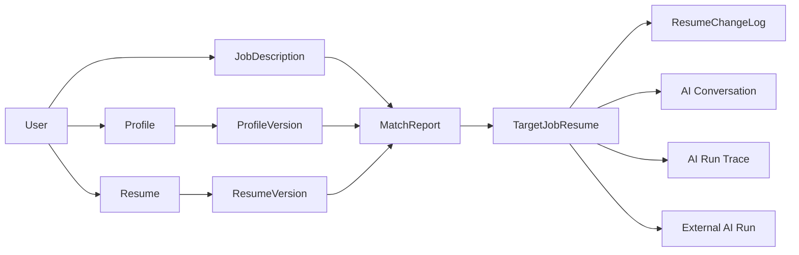
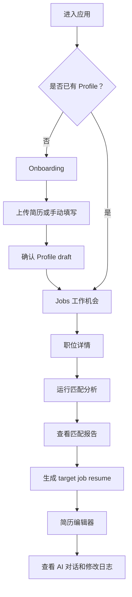

# 产品边界

## 一句话定位

Career Workbench 是面向开发者求职的 AI 工作台：用个人事实库和目标 JD 生成可信、可追溯、可编辑的定制简历。

## 用户与角色

| 角色 | 使用场景 | 当前边界 |
|---|---|---|
| 普通用户 | 上传或维护 Profile、查看职位、生成定制简历和编辑 | MVP 主体 |
| Admin | 导入职位、维护 JD、查看解析状态 | 先保留边界，不急着做独立后台 |
| 面试官/访客 | 用 mock demo 理解产品链路和技术能力 | 不需要真实账号和真实隐私数据 |

## MVP 闭环

1. 用户首次进入完成 onboarding：上传简历解析到 Profile，或手动维护 Profile。
2. Admin 导入工作机会；MVP 不开放普通用户上传职位。
3. 用户查看 Jobs 列表和职位详情。
4. 系统对比 Profile、base resume 和目标 JD，输出匹配分析、缺口和风险表达。
5. 用户针对某个 target job 生成定制简历草稿。
6. 用户在简历编辑器中通过预览、AI Rewrite、Editor、Style 调整内容。
7. 系统保存简历来源、AI 对话和修改日志。
8. AI Run Trace 展示每次 AI 协作过程和人工采纳记录。

## 核心对象

核心原则：

- `Profile` 是可信事实库，AI 不能脱离它编造经历。
- `base resume` 是用户原始简历，`target job resume` 是针对某个 JD 的版本。
- `MatchReport` 连接 `ProfileVersion`、`ResumeVersion` 和 `JobDescription`。
- `AI Run Trace` 记录系统做了什么；`ResumeChangeLog` 记录用户可见的简历变更。
- Dify 或其他外部 AI 服务只负责编排和生成，业务状态以本项目数据库为准。

## 页面流程

## MVP 必做

- 工作台信息架构：Jobs、Resumes、Profile、Settings。
- Onboarding：上传简历解析到 Profile，或手动填写 Profile。
- Admin 导入工作机会：手动粘贴 JD、职位链接、截图导入。
- Profile 事实库。
- JD 结构化解析和匹配分析。
- target job resume 生成。
- 简历列表：区分 `manual_upload` 和 `target_job`。
- 简历编辑器：Preview、AI Rewrite、Editor、Style。
- AI 对话、修改日志、Compare to original。
- mock/demo 模式：没有 API key 和 Supabase 配置也能演示。

## 暂不做

- 不做完整招聘平台。
- 不开放普通用户上传职位。
- 不做大规模职位爬取和招聘网站聚合。
- 不做自动投递。
- 不做 Chrome 插件。
- 不做 referral、人脉推荐。
- 不做面试题、教练、课程。
- 不做复杂模板市场。

## 数据来源边界

LinkedIn 等站点存在登录态、反爬和服务条款限制，MVP 不把自动爬取作为关键依赖。

优先路径：

- Admin 手动粘贴 JD 文本。
- Admin 粘贴职位链接并手动补充 JD。
- Admin 上传截图，后续通过 OCR 或人工校正转成 JD。
- 如果后续做浏览器辅助采集，只读取管理员当前浏览器页面可见文本，不保存 cookies，不绕过反爬。

## 产品风险

- AI 信任风险：用户不确定生成内容是否真实可信。
- 胡编风险：没有证据追踪时，AI 容易夸大经历。
- 隐私风险：简历和 JD 数据敏感，需要最小上传和清楚的数据边界。
- 第三方编排风险：小范围 MVP 可用 Dify Cloud，真实私有数据规模化前要评估自托管或自建 adapter。
- 付费意愿风险：求职工具可能短期使用，续费周期不稳定。
