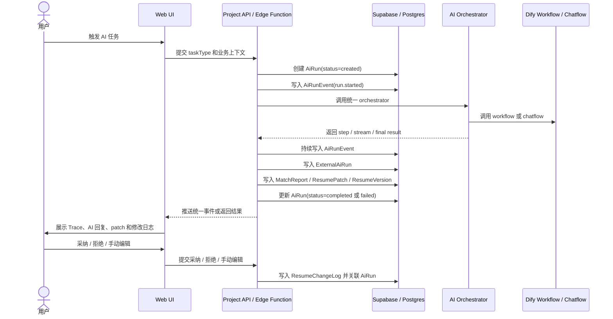

# AI Trace 全流程设计

_状态:📐 设计中,尚未落地_

## 目标

AI Trace 是 Career Workbench 的 AI 协作证据链,不是普通 debug log。它要让用户和开发调试视图
都能看清楚:这次 AI 任务为什么开始、输入了哪些业务上下文、用了哪个 prompt/Dify workflow 或
fallback provider、中间经历哪些 step/delta/patch/report/错误、最终生成了什么业务对象、用户
采纳/拒绝/手动修改了哪些内容。

第一版先把流程、数据模型和事件协议规划清楚。真实 Dify API、Supabase migration、前端 Trace
面板和开发 mock runner 可在后续实现阶段分开落地。

## 边界

覆盖四类 AI 任务:

- `resume_parse`:上传简历后解析为 profile draft 或 profile version。
- `match_analysis`:对比 JD 与 profile/resume,生成匹配分析。
- `resume_generation`:为目标 JD 生成 target job 简历版本。
- `resume_chat`:围绕某份简历和 section 进行多轮修改建议。

不覆盖:复杂富文本编辑器实现、真实职位爬取或自动投递、Dify workflow 内部节点的具体 prompt
编排细节。

## 核心原则

- Career Workbench 拥有业务状态;Dify 只负责 AI 编排和结构化输出。
- Dify 不能直接修改 `ResumeVersion`,只能返回建议、报告或候选 patch。
- 所有 AI 输出先进入 trace,再转换为业务对象;所有业务对象都必须能反查 `ai_run_id`。
- Dify 的 `workflow_run_id`、`conversation_id`、`message_id` 只作为外部引用保存,不作为本
  系统主键。
- mock provider、Dify provider、OpenAI-compatible provider 必须共享同一套事件协议。
- 普通用户看到业务化时间线;开发调试模式可看到完整 trace、外部 ID、输入输出摘要和错误。

## 用户可见行为

### 普通用户视图

Resume 页面展示:AI 对话列表、pending patch 卡片、采纳/拒绝状态、修改日志时间线、每条日志可
跳到对应 section。描述使用业务语言,例如:「AI 根据 ThriveCart JD 生成了 Summary 修改建议。」
「你拒绝了 Experience section 的一条建议。」「你手动修改了 Skills section。」

### Debug / 面试视图

Trace 面板展示:`runId`、`taskType`、`status`、`workflowKey`、`promptVersion`、
`orchestrator`、`provider`、Dify 外部 ID、输入摘要、输出摘要、事件时间线、关联业务对象 ID、
错误摘要。该视图用于解释全栈链路、AI 编排、SSE、持久化和人工审核闭环。

## 数据与状态边界

### 总体流程



### 职责边界

- **Web UI:** 收集用户触发动作和业务上下文;展示进度、对话、patch、日志和 Trace 面板;不
  直接调 Dify,不持有任何 key;普通模式显示业务摘要,调试模式显示完整 trace。
- **前端开发 mock runner:** 当前 `apps/web` 是 Vite 静态前端,不承载服务端 API 路由;本地
  mock AI run、trace fixture 回放、非敏感 fixture 读取适合先放前端 mock 层;不保存长期敏感
  数据,不持有 key。
- **Supabase Edge Function:** 承载需保密 key 或持久化事务的 AI 任务——创建 `ai_runs`、调用
  Dify、写 `ai_run_events`/`external_ai_runs`/业务结果、处理失败超时重试、用 service role 在
  RLS 边界内受控写入。
- **packages/ai:** 统一事件类型、Dify client、mock provider、OpenAI-compatible fallback
  adapter、prompt/workflow registry、Dify 输出到业务 artifact 的解析与校验。
- **packages/domain:** `ResumeVersion` 数据契约、`ResumePatch` 与 section 定位、
  `ResumeChangeLog` 事件类型、patch 采纳/拒绝/手动编辑的业务规则。
- **packages/db:** `AiRunRepository`、`AiRunEventRepository`、`ExternalAiRunRepository`、
  `ResumeConversationRepository`、`ResumePatchRepository`、`ResumeChangeLogRepository`、
  `MatchReportRepository`。

### AiRun 生命周期

状态:`created`(已收到任务,未调 provider)→ `running`(本地 step 或外部 workflow 已开始)
→ `waiting_external`(等 Dify 返回)→ `completed`(成功,artifact 已存)/`failed`(失败,
错误摘要和已发生事件已存)/`cancelled`(取消,保留取消前事件)。

```txt
created -> running -> waiting_external -> completed
created -> running -> failed
created -> running -> waiting_external -> failed
created -> running -> cancelled
```

`failed` 不等于无记录。失败时也必须保存:用户输入摘要、已选 profile/job/resume 上下文摘要、
provider、prompt/workflow key、已获得的 Dify 外部 ID、错误类型和可读错误摘要、失败前已发生的
事件。

### 统一事件协议

所有 provider 输出同一套事件。前端、SSE、Trace 面板和数据库只依赖统一事件,不依赖 Dify 节点
结构。事件类型:`run.started`、`step.started`、`step.delta`(流式文本/进度/中间观察)、
`artifact.patch`、`artifact.report`、`step.completed`、`run.completed`、`run.failed`。

最小事件字段:

```txt
eventId / runId / eventType / sequence / stepKey / title / summary / payload / createdAt
```

约束:`sequence` 在同一 `runId` 内单调递增;`payload` 存结构化数据,不存不可控大段原始隐私
文本;`summary` 用于 UI 和日志快速展示;`artifact.patch` 必须能关联 `resume_patch_id` 或可
转换为 `ResumePatch`;`artifact.report` 必须能关联 `match_report_id` 或可转换为 `MatchReport`。

### Dify Workflow / Chatflow 映射

| 业务任务     | taskType              | Dify 类型                     | workflow key                  | 主要输出                  | 写入                                                                        |
| ------------ | --------------------- | ----------------------------- | ----------------------------- | ------------------------- | --------------------------------------------------------------------------- |
| 简历解析     | `resume_parse`        | Workflow + Document Extractor | `resume.profile.normalize.v1` | profile draft、证据       | `ProfileVersion` draft、`AiRun`、`AiRunEvent`、`ExternalAiRun`              |
| JD 解析      | `match_analysis` 前置 | Workflow                      | `job.jd.parse.v1`             | 结构化 JD                 | `JobDescription` 字段、`AiRunEvent`                                         |
| 匹配分析     | `match_analysis`      | Workflow                      | `match.report.generate.v1`    | 分数、缺口、风险、证据    | `MatchReport`、`AiRun`、`AiRunEvent`、`ExternalAiRun`                       |
| 定制简历生成 | `resume_generation`   | Workflow                      | `resume.tailor.generate.v1`   | target resume draft、理由 | `ResumeVersion`、`ResumeChangeLog`、`AiRun`、`AiRunEvent`、`ExternalAiRun`  |
| 简历修改建议 | `resume_chat`         | Chatflow                      | `resume.suggestion.review.v1` | 自然语言回复、patch       | `ResumeConversation`、`ResumePatch`、`AiRun`、`AiRunEvent`、`ExternalAiRun` |

Dify 输出要求:优先 JSON schema 输出;每个输出含业务对象类型、摘要、风险提示和证据引用;
Chatflow 可返回自然语言回复,但 patch 必须结构化;Dify 返回的外部 ID 必须写入
`external_ai_runs`。

### 数据模型规划

以下是建模设计,不代表本阶段立即创建 migration。

- **`ai_runs`**(一次 AI 任务主记录):`id`、`user_id`、`task_type`、`status`、`orchestrator`、
  `provider`、`model_name`、`workflow_key`、`prompt_version`、`profile_version_id`、
  `job_description_id`、`resume_id`、`resume_version_id`、`input_summary`、`result_summary`、
  `error_code`、`error_summary`、`started_at`、`completed_at`、`created_at`、`updated_at`。
  索引:`(user_id, created_at desc)`、`(task_type, status)`、`(resume_version_id, created_at
desc)`、`(job_description_id, created_at desc)`。
- **`ai_run_events`**(事件时间线):`id`、`ai_run_id`、`sequence`、`event_type`、`step_key`、
  `title`、`summary`、`payload_json`、`created_at`。索引:`(ai_run_id, sequence)`。
- **`external_ai_runs`**(外部运行引用):`id`、`ai_run_id`、`orchestrator`、`provider`、
  `workflow_key`、`workflow_run_id`、`conversation_id`、`message_id`、`external_status`、
  `request_id`、`raw_metadata_json`、`created_at`、`updated_at`。索引:`(ai_run_id)`、
  `(workflow_run_id)`、`(conversation_id)`、`(message_id)`。
- **`resume_conversations`**(简历级对话):`id`、`resume_id`、`resume_version_id`、`ai_run_id`、
  `user_id`、`role`、`content`、`section_id`、`quick_prompt_key`、`dify_conversation_id`、
  `dify_message_id`、`created_at`。
- **`resume_patches`**(AI 生成但未必采纳的结构化建议):`id`、`resume_id`、`resume_version_id`、
  `ai_run_id`、`conversation_id`、`section_id`、`status`、`original_summary`、`next_text`、
  `evidence_refs_json`、`risk_notes_json`、`confidence`、`created_at`、`decided_at`。
  `status`:`pending`/`accepted`/`rejected`/`superseded`。
- **`resume_change_logs`**(用户可见修改日志):`id`、`resume_id`、`resume_version_id`、
  `ai_run_id`、`resume_patch_id`、`actor`、`change_type`、`section_id`、`before_summary`、
  `after_summary`、`source_refs_json`、`created_at`。`actor`:`user`/`ai`/`system`;
  `change_type`:`ai_generated_initial`、`ai_suggested_patch`、`user_accepted_patch`、
  `user_rejected_patch`、`user_manual_edit`、`user_reordered_section`、`user_changed_style`、
  `user_exported_resume`。
- **`match_reports`**(JD × profile/resume 匹配结果):`id`、`user_id`、`job_description_id`、
  `profile_version_id`、`resume_version_id`、`ai_run_id`、`score`、`summary`、`strengths_json`、
  `gaps_json`、`risk_notes_json`、`evidence_refs_json`、`created_at`。

### 业务对象归属

- `match_analysis` 成功后写 `MatchReport`,通过 `ai_run_id` 反查 trace。
- `resume_generation` 成功后写新 `ResumeVersion`,同时写
  `ResumeChangeLog(change_type=ai_generated_initial)`。
- `resume_chat` 成功后先写 `ResumeConversation` 和 `ResumePatch(status=pending)`。
- 采纳 patch:更新 `ResumePatch(status=accepted)` → 改 `ResumeVersion` 对应 section → 写
  `ResumeChangeLog(user_accepted_patch)`。
- 拒绝 patch:更新 `ResumePatch(status=rejected)` → 写 `ResumeChangeLog(user_rejected_patch)`
  → 不改正文。
- 手动编辑:改 `ResumeVersion` 对应 section → 写 `ResumeChangeLog(user_manual_edit)` → 若源自
  某 AI patch,可保留 `resume_patch_id`。

### Resume Chat 完整链路

1. 用户在 Resume 页面选 section,输入修改要求。
2. UI 提交 `resume_chat` 请求(`resume_id`、`resume_version_id`、`section_id`、用户输入、目标
   JD 摘要、可用 evidence refs)。
3. API / Edge Function 创建 `AiRun(status=created, task_type=resume_chat)`。
4. 写 `AiRunEvent(run.started)`。
5. 调 `resume.suggestion.review.v1` Chatflow。
6. 获得 Dify `conversation_id`、`message_id` 后写 `ExternalAiRun`。
7. 将 Dify 回复转换为 `ResumeConversation(role=assistant)`、`ResumePatch(status=pending)`、
   `AiRunEvent(artifact.patch)`。
8. 更新 `AiRun(status=completed)`,写 `run.completed`。
9. UI 显示 AI 回复、patch 摘要、证据来源、风险提示和采纳/拒绝按钮。
10. 采纳后写 `ResumeChangeLog(user_accepted_patch)`;拒绝后写
    `ResumeChangeLog(user_rejected_patch)`。

### 反查路径

```txt
# 从 resume section 反查 AI run
resume_version_id + section_id -> resume_change_logs -> resume_patch_id / ai_run_id
  -> ai_runs -> ai_run_events / external_ai_runs

# 从 Dify workflow run id 找回业务对象
workflow_run_id -> external_ai_runs -> ai_runs
  -> match_reports / resume_patches / resume_versions / resume_change_logs

# 从 match report 找回输入上下文
match_report.ai_run_id -> ai_runs -> profile_version_id + job_description_id + resume_version_id
  -> ai_run_events
```

### Mock 与真实 Dify 的一致性

mock provider 必须模拟真实 provider 的关键边界:创建 `AiRun`、输出统一事件、生成
`artifact.patch` 或 `artifact.report`、写入同样形状的 `AiRunEvent`、使用同样的 `workflow_key`
和 `prompt_version`、返回可被前端采纳/拒绝的 pending patch。真实 Dify provider 只替换 provider
调用层,不改变 UI、数据库事件协议和业务对象归属。

## 失败与降级

Dify 或 fallback provider 失败时:`AiRun.status` 更新为 `failed`;写 `AiRunEvent(run.failed)`;
保存 `error_code` 和用户可读 `error_summary`;已获得的 `workflow_run_id`/`conversation_id`/
`message_id` 仍写 `ExternalAiRun`;用户输入写 `ResumeConversation(role=user)` 避免丢失上下文;
不创建已完成业务结果;失败前已产生的 pending patch 必须标记为 `superseded` 或保留为 pending
并显示「生成未完成」的风险状态。

用户可见降级:允许重试同一上下文;允许切换手动编辑;Trace 面板显示失败阶段和错误摘要。

## 验收

后续实现拆分(建议顺序):

1. 类型与事件协议:在 `packages/ai` 和 `packages/domain` 定义共享契约。
2. mock trace runner:不依赖 Dify,先跑通事件和业务 artifact。
3. Supabase schema:创建 `ai_runs`、`ai_run_events`、`external_ai_runs`、`resume_conversations`、
   `resume_patches`、`resume_change_logs`、`match_reports`。
4. Dify adapter:接入 Workflow / Chatflow,转换为统一事件。
5. API / SSE endpoint:把 run 事件推给前端并持久化。
6. 前端 Trace 面板:展示普通用户时间线和 Debug 视图。
7. Resume patch 采纳/拒绝流程:连接 patch、section、change log 和 trace。

规划完成后,后续实现者必须能从本文回答:

- 一次 AI 简历修改从点击按钮到写入修改日志,中间经过哪些对象。
- Dify 返回失败时系统保存什么;用户拒绝 AI patch 后 trace 和 change log 怎么记录。
- 如何从某个 resume section 反查对应 AI run;如何从 Dify workflow run id 找回本项目业务对象。
- mock provider 和真实 Dify provider 如何共享同一套事件协议。

## 相关

- [AI对话与修改日志](./AI对话与修改日志.md) · [工作机会](./工作机会.md) ·
  [Supabase持久化](./Supabase持久化.md)
- 后端函数现状见 [backend.md](../docs/architecture.md#backend)。
